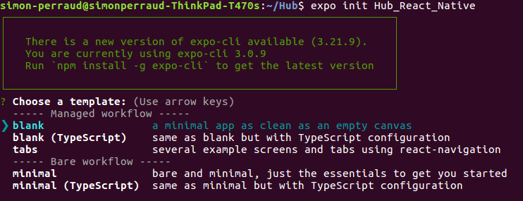
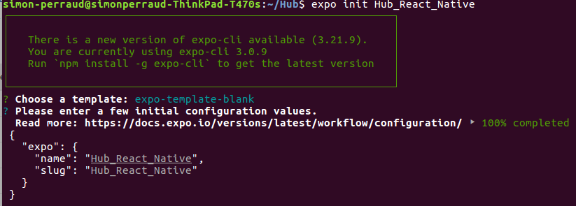
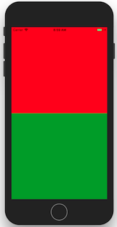
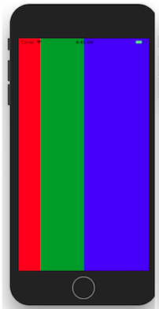

# Introduction au React-Native

Bonjour, voici un petit workshop pour faire une introduction au bases du React-Native et plus particulièrement une CRNA (Create-React-Native-App).

C'est l'un des 2 type d'application mobile possible en React-Native, elle a le grand avantage de permettre un développement rapide avec presque aucune configuration requis, le seul inconvénient étant qu'elle n'a pas access au code natif ce qui limite parfois les possibilités de l'application.

Ce type d'application utilisent Expo, une application mobile qui simplifie grandement le développement, il va falloir la télécharger sur le store de votre téléphone.

Il faudras aussi installer le systeme d'expo sur votre ordinateur avec la commande suivante
```
$> npm install -g expo-cli
```

Pour les utilisateur d'atom, je suggére le package Nuclide qui permet de simplifier le développement en React-Native

Ensuite, nous allons utiliser une commande qui va nous génerer automatiquement notre dossier avec tout ce qu'il faut.

```
$> expo init PROJECTNAME
```




Maitenant pour lancer notre projet il suffit de tapper la commande suivante dans un terminal dans le dossier créer précedement.

```
$> npm start
```

Ce qui va nous génerer un QR code a scanner avec l'application Expo et vous aurez directement l'application sur votre téléphone.
Pour les utilisateur d'IOS il faut le scanner avec l'application Camera de base.

Une chose magique avec le react-native est qu'il n'est presque jamais nécessaire de Reload votre application, les modification prennent effet en live.
```
<Text>Open up App.js to start working on your app!</Text>
```
Essayez de modifier ce texte, sauvegardez le fichier et retourner sur l'appli pour voir le résultat.

# Components

On va commencer par la notion de components, cela permet de découper vos IU pour facilement ré-utiliser certaines parties.
Un exemple simple est celui d'un bureau avec une table et un PC, sans les composants il serais compliqué de ré-utiliser le PC autre part.
Avec les components on as juste a faire un component PC et on peux l'appeller où on veux.

Il y a 2 type de Component, ceux déjà existant avec react-Native et les Custom que l'ont peux créer nous même

Les Component sont par exemple  Text, Button, Image, ScrollView, View, WebView. Il vous suffit de les importer pour les utiliser.

Les Component custom quand a eux sont a créer nous même et il est a noter que le mot Custom n'est pas totalement bien choisit. Un Component custom est en fait un regroupement fait maison de Components de base ce qui nous permet d'arranger ça a notre sauce.

Nous allons donc commencer par créer quelques Component Custom et afin de bien ranger tout ça on va créer un dossier Component a la racine du projet.

Maitenant 1er exercice de ce Workshop, il va falloir créer un Component custom avec 2 Component a l'intérieur. Un boutton et une barre de recherche où l'ont peux rentrer du texte.

Votre App.js devras afficher directement ce Component et rien d'autre.

```
import React from 'react'
import { View, Button, TextInput } from 'react-native'

class Search extends React.Component {
    render() {
        return (

        )
    }
}
```
je vous donne ici la base d'un Component Custom, a vous de faire la suite !

# Flex Boxes

Une fonctionnalitée extremement utile en développement mobile. Étant donné que tout les mobiles n'ont pas la mme taille d'écran, rentrer des tailles fixes sur vos components finiras toujours ar vous donner des résultats bizzare sur certaines résolutions.

C'est pourquoi le systéme de Flex Box existe, cela permet d'ajuster automtiquement la taille des élement pour prendre la bonne portion de l'écran et donc s'adapter a tout type de résolutions.

L'objectif ici seras d'obtenir ce résultat en créeant un Component Custom et ce sans spécifier une seule fois une taille a vos Component, vous devrez uniquement utiliser les flex box.



Vous pouvez ensuite essayer d'obtenir ce genre de résultat un poil plus complexe.



# La suite

Et ce seras tout pour ce petit Workshop, je préfére rester sur une introduction et vous rédiriger vers le guide de OpenClassrooms bien plus complet sur le sujet.

https://openclassrooms.com/fr/courses/4902061-developpez-une-application-mobile-react-native/4916061-appliquez-des-styles-a-vos-components

Merci d'avoir continué jusque ici !
